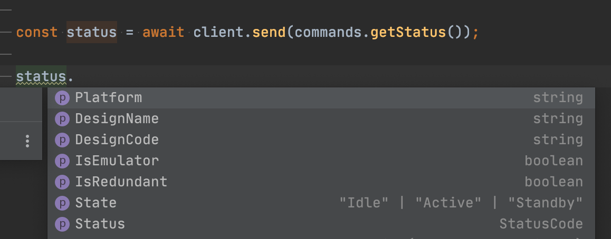

# qsys-qrc-client 

> A type-safe control client for QSC Q-SYS cores, written in Node.js.

## Install

```
$ npm install qsys-qrc-client zen-observable zod
```

* Installing `zod` as a peer dependency is required to use the `ZodValidator`.

* An `Observable` implementation is required for `pollGroup` usage. `zen-observable` is a minimal implementation. `RxJs` is also a popular option. But you can use whichever Observable implementation you want. See [any-observable](https://www.npmjs.com/package/any-observable).

## Usage

```js
import QrcClient, {commands, ZodValidator} from 'qsys-qrc-client';

// Validator is totally optional... Helpful to catch bugs early in development.
const validator = new ZodValidator({
	// all options are optional and have sensible defaults.
	parseLevel: {
			commands: 'strict', // do not allow unknown properties on commands you send
			results: 'loose', // allow unknown properties on responses from the core
	},
	onParseFailure: {
			commands: 'logAndThrow', // log and fail immediately
			results: 'log' // just log that a validation failure.
			// Available options are 'throw', 'log', 'logAndThrow', 'ignore', or a custom function.
	}
})

const client = new QrcClient({validator});
client.connect({
  port: 1710,
  host: '192.168.1.10'
});

async function checkStatus() {
  // The send function returns Promises, use the await syntax for synchronous-like code flow.
  const status = await client.send(commands.getStatus());
  console.log(`${status.DesignName} is running on a ${status.Platform}`);
  //=> "My Test Design is running on a Emulator"
}
```

The zod validator is used to auto-generate the included type-system, and run against the emulator during testing with `strict` mode and `logAndThrow` for both commands and responses. This ensures our types accurately reflect reality. It's not necessary that you install `zod` or enable the validator for production.


## API

### client.send(command)

##### command

Type: Any valid [QRC command](https://q-syshelp.qsc.com/Content/External_Control_APIs/QRC/PARAPI.htm).

You should generate most commands using the built-in `commands` object, as described below.

> *Note:* It is not necessary to insert the `"jsonrpc": "2.0"` version number in your command. The client will insert it automatically if it is not present.

##### returns

Type: `Promise<Object>`

See [the documentation](https://q-syshelp.qsc.com/Content/External_Control_APIs/QRC/PARAPI.htm) for specific return types.

### commands.getStatus() / commands.login(username, password) / etc.

The `commands` object has a number of helper functions to create specific QRC commands. They include type information for the parameters, and the expected return values. Modern IDE's should provide type hints out of the box.



For this reason, it is always recommended you use the `commands` object to generate the command objects. But you can create commands by hand if needed (i.e. a new command is not yet implemented here).

### validation

The library includes two different validators for validating both commands and responses:
  * A singleton `noopValidator` instance that bypasses any validation (relying on errors returned from the Q-Sys core to identify mistakes). This is the default as it removes the runtime dependency on `zod`. (You will still need `zod` as a dev dependency for type inference though).
  * A `ZodValidator` that is capable of validating both commands and responses. It can be configured for `loose` or `strict` validation in either direction, and it can be configured to throw or just log the error. See the `ParseOptions` export.

Note: It's unlikely you want `strict` mode for response parsing on the `ZodValidator`. That mode is used during development so our tests throw errors if our validation types don't match the response.

### client.pollGroup(groupId, options)

A convenience class for sending poll group commands. It implements observable, so you can just listen to changes.
You must send the `autoPoll` command for change events to occur, however.


 ```js
const group = client.pollGroup('groupId');
group.addControl('controlName1', 'controlName2');

group.subscribe(data => {
    for (const change of data.Changes) {
      if(change.Name === 'controlName1') {
        // do something with change.Value / change.String / change.Position
      } else if (change.Name === 'controlName2') {
        // do something with change.Value / change.String / change.Position
      }
    }
});

// Start receiving events, updated 10x a second:
group.autoPoll(0.1);
 ```

##### groupId

Type: `string`

The `groupId` of the group of values you want to change. It should already have been setup.

##### options.rate

Type: `number`
Default: `0.2`

The maximum rate (in seconds) at which to send updates.

##### options.autoDestroy

Type: `boolean`
Default: `false`

If `true`, then when the last observer unsubscribes from the Observable, the polling group will be automatically destroyed. There are perils with either choice. If you enable `autoDestroy`, then you must rebuild the polling group to observe those values again, if you do not, then you must remember to destroy the group yourself with `client.send(commands.destroyGroup('groupId'))`

##### returns

Type: `Observable<AutoPollUpdate>`

Observables are a specification for observing changing data. You can find more information at the following resources:
  * [T39 Spec](https://github.com/tc39/proposal-observable)
  * [RxJS](https://github.com/ReactiveX/RxJS) A popular, full-featured implementation.
  * [zen-observable](https://github.com/zenparsing/zen-observable) A lightweight implementation.
  * [any-observable](https://www.npmjs.com/package/any-observable) Does not provide an actual observable implementation. Use it to specify which Observable implementation you want to use (if `zen` or `RxJs` are installed, they will be found automatically).

## Convenience Imports

Rather than importing the entire `commands` object, you can import just the specific commands you need, and use a slightly less verbose syntax:

```js
import QrcClient, {getStatus} from 'qsys-qrc-client';

// ...

client.send(getStatus());
```

The typescript declarations also export a handful of useful type definitions (used to provide type hints in your IDE), that you can import and reuse.

```ts
import QrcClient, {commands, EngineStatus} from 'qsys-qrc-client';

let status: EngineStatus;

// ...

status = await client.send(commands.getStatus());
```

## Contributing

Bug Reports and Pull Requests are always welcome. To get started.
  1. Install `Node.js` and `git`
  2. Clone the repository.
  3. Run `npm install` in the cloned directory to pull down all the dependencies.
  4. Run `npm test` to test any changes.

A very simple design file is included in the `integration-tests` folder, and it is used to test the client against an actual design running in Emulator. It defaults to connecting to `localhost` but you can change it by putting the connection information in `integration-tests/design-location.json`. This can be useful if developing on a non-Windows machine.

## License

MIT © [James Talmage](http://jrtechnical.com)
