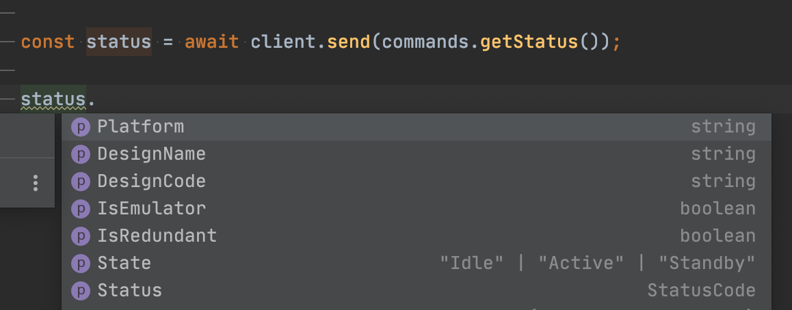

# qsys-qrc-client 

> An external control client for QSC Q-SYS cores, written in Node.js.

## Install

```
$ npm install qsys-qrc-client zen-observable
```

You can replace `zen-observable` with whichever Observable implementation you want. See [any-observable](https://www.npmjs.com/package/any-observable).

## Usage

```js
import QrcClient, {commands} from 'qsys-qrc-client';

const client = new QrcClient();
client.connect({
  port: 1710,
  host: '192.168.1.10'
});

async function checkStatus() {
  // The send function returns Promises, use the await syntax for synchronous-like code flow.
  const status = await client.send(commands.getStatus());
  console.log(`${status.DesignName} is running on a ${status.Platform}`);
  //=> "My Test Design is running on a Emulator"
}
```


## API

### client.send(command)

##### command

Type: Any valid [QRC command](https://q-syshelp.qsc.com/Content/External_Control/Q-Sys_Remote_Control/QRC.htm).

You should generate most commands using the built-in `commands` object, as described below.

> *Note:* It is not necessary to insert the `"jsonrpc": "2.0"` version number in your command. The client will insert it automatically if it is not present.

##### returns

Type: `Promise<Object>`

See [the documentation](https://q-syshelp.qsc.com/Content/External_Control/Q-Sys_Remote_Control/QRC.htm) for specific return types.

### commands.getStatus() / commands.login(username, password) / etc.

The `commands` object has a number of helper functions to create specific QRC commands. They include type information for the parameters, and the expected return values. Modern IDE's should provide type hints out of the box.



For this reason, it is always recommended you use the `commands` object to generate the command objects. But you can create commands by hand if needed (i.e. a new command is not yet implemented here).

### client.pollGroup(groupId, options)

The only command not sent using `client.send(...)`. It returns an observable that updates every time values in the polling group change.

Before calling, you need to setup the polling group:

 ```js
await client.send(commands.addNamedControlToGroup('groupId', ['controlName1', 'controlName2']));

const observable = client.pollGroup('groupId', 0.1);

observable.subscribe(data => {
    for (const change of data.Changes) {
      if(change.Name === 'controlName1') {
        // do something with change.Value / change.String / change.Position
      } else if (change.Name === 'controlName2') {
        // do something with change.Value / change.String / change.Position
      }
    }
});
 ```

##### groupId

Type: `string`

The `groupId` of the group of values you want to change. It should already have been setup.

##### options.rate

Type: `number`
Default: `0.2`

The maximum rate (in seconds) at which to send updates.

##### options.autoDestroy

Type: `boolean`
Default: `false`

If `true`, then when the last observer unsubscribes from the Observable, the polling group will be automatically destroyed. There are perils with either choice. If you enable `autoDestroy`, then you must rebuild the polling group to observe those values again, if you do not, then you must remember to destroy the group yourself with `client.send(commands.destroyGroup('groupId'))`

##### returns

Type: `Observable<AutoPollUpdate>`

Observables are a specification for observing changing data. You can find more information at the following resources:
  * [T39 Spec](https://github.com/tc39/proposal-observable)
  * [RxJS](https://github.com/ReactiveX/RxJS) A popular, full-featured implementation.
  * [zen-observable](https://github.com/zenparsing/zen-observable) A lightweight implementation.
  * [any-observable](https://www.npmjs.com/package/any-observable) Does not provide an actual observable implementation. Use it to specify which Observable implementation you want to use (if `zen` or `RxJs` are installed, they will be found automatically).

## Convenience Imports

Rather than importing the entire `commands` object, you can import just the specific commands you need, and use a slightly less verbose syntax:

```js
import QrcClient, {getStatus} from 'qsys-qrc-client';

// ...

client.send(getStatus());
```

The typescript declarations also export a handful of useful type definitions (used to provide type hints in your IDE), that you can import and reuse.

```ts
import QrcClient, {commands, EngineStatus} from 'qsys-qrc-client';

let status: EngineStatus;

// ...

status = await client.send(commands.getStatus());
```

## Contributing

Bug Reports and Pull Requests are always welcome. To get started.
  1. Install `Node.js` and `git`
  2. Clone the repository.
  3. Run `npm install` in the cloned directory to pull down all the dependencies.
  4. Run `npm test` to test any changes.

A very simple design file is included in the `integration-tests` folder, and it is used to test the client against an actual design running in Emulator. It defaults to connecting to `localhost` but you can change it by putting the connection information in `integration-tests/design-location.json`. This can be useful if developing on a non-Windows machine.

## License

MIT © [James Talmage](http://jrtechnical.com)
